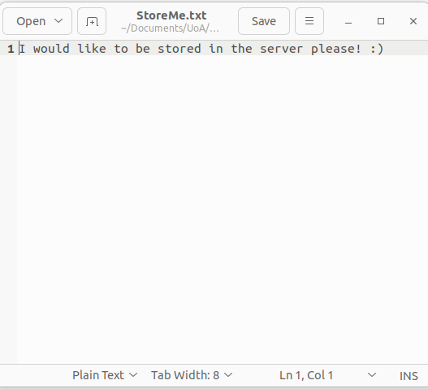
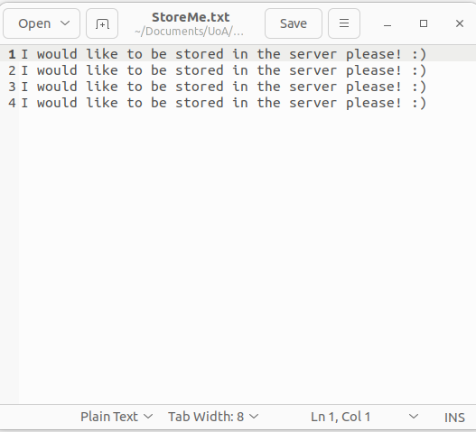

# RFC 913
Author: Isabelle Johns

## Setup

This implemetation has been designed to run on a Linux system. 
The Server hosts each Client on a different thread, allowing it to serve multiple clients at once.

**Server Setup**

1. Open a new command prompt
2. Change directory to the `RFC913-SFTP/Server` directory
3. (First time only) You may need to execute the following command to give `./run.sh` permission: `chmod +x ./run.sh`
4. Execute the 'run' script with `./run.sh` to start the server

**Client Setup**

1. Open a new command prompt
2. Change directory to the `RFC913-SFTP/Client` directory 
3. (First time only) You may need to execute the following command to give `./run.sh` permission: `chmod +x ./run.sh`
4. Execute the 'run' script with `./run.sh` to start the client

The login information can be found below. These logins are informed by the `/Server/login.txt` file.
Commands are case-insensitive, however information like filenames and directories are case-sensitive.

All commands from the RFC-913 SFTP have been implemented. You can view the RFC-913 commands and their functions [here](https://www.rfc-editor.org/rfc/rfc913). 

| User-id         | Account             | Password |
|-----------------|---------------------|----------|
| user_only       |                     |          |
| user_w_pwd      |                     | pass1    |
| user_w_acc      | acc1,               |          |
| user_w_both     | acc2                | pass2    |
| multi_acc       | acc1 acc2 acc3      |          |
| multi_acc_w_pwd | acc1 acc2 acc3 acc4 | pass3    |

## Testing

To test, _first follow the steps as described in **Server Setup** to run the server_. The testing script can then be run:
1. Open a new command prompt
2. Change directory to the `RFC913-SFTP/Server` directory (if not already in that directory)
3. (First time only) You may need to execute the following command to give `./test.sh` permission: `chmod +x ./test.sh`
4. Execute the 'test' script with `./test.sh` to start the testing client

**1. User ID with no password or account**
~~~
+[hostname] RFC-913 SFTP
Enter command: USER user_only
! Logged in as user_only
Enter command: DONE
+Connection closed.
~~~

**2. User ID with no password or account, attempted sign in with account and password** 
~~~
+[hostname] RFC-913 SFTP
Enter command: USER user_only
! Logged in as user_only
Enter command: PASS somePassword
-Already logged in.
Enter command: ACCT someAcct
-Already logged in. No accounts associated with this user.
Enter command: DONE
+Connection closed.
~~~

**3. Invalid user ID**
~~~
+[hostname] RFC-913 SFTP
Enter command: USER 
-user is not a valid user-id. Please try again.
Enter command: USER benjamin
-benjamin is not a valid user-id. Please try again.
Enter command: DONE
+Connection closed.
~~~

**4. User with password and no accounts**
~~~
+[hostname] RFC-913 SFTP
Enter command: USER user_w_pwd
+User-id valid, send account and/or password.
Enter command: ACCT acct1
+Account valid (or not needed), send password.
Enter command: PASS pass1
! Password is correct (or not needed), logged in.
Enter command: ACCT acct1
! Account valid (or not needed), logged in.
Enter command: DONE
+Connection closed.
~~~

**5. User with password and no accounts, incorrect password**
~~~
+[hostname] RFC-913 SFTP
Enter command: USER user_w_pwd
+User-id valid, send account and/or password.
Enter command: PASS wrongPwd
-Wrong password, try again.
Enter command: PASS PASS1
-Wrong password, try again.
Enter command: PASS pass1
! Password is correct (or not needed), logged in.
Enter command: DONE
+Connection closed.
~~~

**6. User with account and no password**
~~~
+[hostname] RFC-913 SFTP
Enter command: USER user_w_acct
+User-id valid, send account and/or password.
Enter command: PASS pass1
-No passwords associated with this user. Please send account.
Enter command: ACCT acct1
! Account valid (or not needed), logged in.
Enter command: PASS pass1
-Already logged in.
Enter command: DONE
+Connection closed.
~~~

**7. User with account and no password, incorrect account**
~~~
+[hostname] RFC-913 SFTP
Enter command: USER user_w_acct
+User-id valid, send account and/or password.
Enter command: ACCT acct8
-Invalid account, try again.
Enter command: ACCT acct2
-Invalid account, try again.
Enter command: ACCT acct1
! Account valid (or not needed), logged in.
Enter command: DONE 
+Connection closed.
~~~

**9. User with both an account and a password**
~~~
+[hostname] RFC-913 SFTP
Enter command: USER user_w_both
+User-id valid, send account and/or password.
Enter command: ACCT acct2
+Account valid (or not needed), send password.
Enter command: PASS pass2
! Password is correct (or not needed), logged in.
Enter command: DONE
+Connection closed.
~~~

**10. User with both an account and a password (alternate)**
~~~
+[hostname] RFC-913 SFTP
Enter command: USER user_w_both
+User-id valid, send account and/or password.
Enter command: PASS pass2
+Password valid (or not needed), send account.
Enter command: ACCT acct2
! Account valid (or not needed), logged in.
Enter command: DONE
+Connection closed.
~~~

**11. User with multiple accounts, no password**
~~~
+[hostname] RFC-913 SFTP
Enter command: USER multi_acct
+User-id valid, send account and/or password.
Enter command: PASS unnecessaryPassword
-No passwords associated with this user. Please send account.
Enter command: ACCT acct2
! Account valid (or not needed), logged in.
Enter command: ACCT acct1
! Account valid (or not needed), logged in.
Enter command: ACCT acct6
-Invalid account, try again.
Enter command: ACCT acct3
! Account valid (or not needed), logged in.
Enter command: DONE
+Connection closed.
~~~

**12. User with multiple accounts and a password**
~~~
+[hostname] RFC-913 SFTP
Enter command: USER multi_acct_w_pwd 
+User-id valid, send account and/or password.
Enter command: ACCT acct2
+Account valid (or not needed), send password.
Enter command: ACCT acct4
+Account valid (or not needed), send password.
Enter command: ACCT acct55
-Invalid account, try again.
Enter command: PASS pass6
-Wrong password, try again.
Enter command: PASS pass3
! Password is correct (or not needed), logged in.
Enter command: DONE
+Connection closed.
~~~

**13. User attempts to access advanced commands without logging in**
~~~
+[hostname] RFC-913 SFTP
Enter command: LIST f
-You are not logged in. Please log in using the USER command.
Enter command: TYPE C 
-You are not logged in. Please log in using the USER command.
Enter command: LIST v ..
-You are not logged in. Please log in using the USER command.
Enter command: KILL DeleteMe.txt              
-You are not logged in. Please log in using the USER command.
Enter command: DONE
+Connection closed.
~~~

**14. User attempts to access advanced commands mid-way through logging in**
~~~
+[hostname] RFC-913 SFTP
Enter command: USER user_w_both
+User-id valid, send account and/or password.
Enter command: LIST f ..
-You are not logged in. Please log in using the USER command.
Enter command: ACCT acct2
+Account valid (or not needed), send password.
Enter command: LIST f ..
-You are not logged in. Please log in using the USER command.
Enter command: PASS pass2
! Password is correct (or not needed), logged in.
Enter command: LIST f ..
+/home/izzy/Documents/UoA/Sem_2_2022/RFC913-SFTP/Server/..
.gitignore
RFC913-SFTP.iml
README.md
Enter command: DONE
+Connection closed.
~~~

**15. Change data transfer mode**
~~~
+[hostname] RFC-913 SFTP
Enter command: USER user_only
! Logged in as user_only
Enter command: TYPE a
+Using ASCII mode.
Enter command: TYPE B
+Using binary mode.
Enter command: TYPE c
+Using continuous mode.
Enter command: TYPE invalid
-Invalid type. Please follow the command 'TYPE' with 'A' (ASCII), 'B' (Byte) or 'C' (Continuous) to select transmission mode.
Enter command: TYPE :)
-Invalid type. Please follow the command 'TYPE' with 'A' (ASCII), 'B' (Byte) or 'C' (Continuous) to select transmission mode.
Enter command: DONE
+Connection closed.
~~~

**16. List current directory**
~~~
+[hostname] RFC-913 SFTP
Enter command: USER user_only
! Logged in as user_only
Enter command: LIST F
+/home/izzy/Documents/UoA/Sem_2_2022/RFC913-SFTP/Server
Tests.class
run.sh
Tests.java
RenameMe.txt
Server.java
test.sh
ServerClientThread.java
Server.class
ServerClientThread.class
login.txt
Enter command: LIST v
+/home/izzy/Documents/UoA/Sem_2_2022/RFC913-SFTP/Server
RenameMe.txt (size: 88 bytes, last modified: 28/08/2022 04:47:01)
Tests.class (size: 3915 bytes, last modified: 28/08/2022 09:19:51)
Tests.java (size: 3599 bytes, last modified: 28/08/2022 09:23:18)
Server.java (size: 1200 bytes, last modified: 28/08/2022 07:55:45)
test.sh (size: 31 bytes, last modified: 28/08/2022 06:33:06)
run.sh (size: 32 bytes, last modified: 23/08/2022 12:20:26)
ServerClientThread.class (size: 15502 bytes, last modified: 28/08/2022 09:19:51)
ServerClientThread.java (size: 22891 bytes, last modified: 28/08/2022 09:29:38)
Server.class (size: 2217 bytes, last modified: 28/08/2022 09:19:51)
login.txt (size: 150 bytes, last modified: 28/08/2022 09:25:31)
Enter command: DONE
+Connection closed.
~~~

**17. List directory of choice (relative or absolute path)**
~~~
+[hostname] RFC-913 SFTP
Enter command: USER user_only
! Logged in as user_only
Enter command: LIST f ..
+/home/izzy/Documents/UoA/Sem_2_2022/RFC913-SFTP/Server/..
.gitignore
RFC913-SFTP.iml
README.md
Enter command: LIST v ../Client
+/home/izzy/Documents/UoA/Sem_2_2022/RFC913-SFTP/Client
run.sh (size: 32 bytes, last modified: 23/08/2022 12:21:12)
Client.class (size: 3958 bytes, last modified: 28/08/2022 07:53:31)
StoreMe.txt (size: 47 bytes, last modified: 28/08/2022 04:46:42)
Client.java (size: 3369 bytes, last modified: 28/08/2022 07:02:24)
Enter command: LIST f /home/izzy/Documents/UoA/Sem_2_2022
+/home/izzy/Documents/UoA/Sem_2_2022
ijoh785.tgz
Enter command: DONE
+Connection closed.
~~~

**18. List directory with invalid format and invalid file path**
~~~
+[hostname] RFC-913 SFTP
Enter command: USER user_only
! Logged in as user_only
Enter command: LIST stuff
-Specify a listing format. Please follow the command 'LIST' with 'F' (standard formatting) or 'V' (verbose formatting).
Enter command: LIST things ..
-Specify a listing format. Please follow the command 'LIST' with 'F' (standard formatting) or 'V' (verbose formatting).
Enter command: LIST v ../Clyint
-/home/izzy/Documents/UoA/Sem_2_2022/RFC913-SFTP/Clyint does not exist. Please try again.
Enter command: LIST F blahblah
-/home/izzy/Documents/UoA/Sem_2_2022/RFC913-SFTP/Server/blahblah does not exist. Please try again.
Enter command: DONE
+Connection closed.
~~~

**19. Change current working directory (relative or absolute path)**
~~~
Enter command: USER user_only                         
! Logged in as user_only
Enter command: CDIR ..
! Changed working directory to /home/izzy/Documents/UoA/Sem_2_2022/RFC913-SFTP
Enter command: CDIR Client
! Changed working directory to /home/izzy/Documents/UoA/Sem_2_2022/RFC913-SFTP/Client
Enter command: LIST f
+/home/izzy/Documents/UoA/Sem_2_2022/RFC913-SFTP/Server/../Client
run.sh
StoreMe.txt
Client.class
Client.java
Enter command: CDIR /home/izzy/Documents/UoA/Sem_1_2022
! Changed working directory to /home/izzy/Documents/UoA/Sem_1_2022
Enter command: CDIR /home/izzy/Documents/UoA/Sem_2_2022        
! Changed working directory to /home/izzy/Documents/UoA/Sem_2_2022
Enter command: LIST f
+/home/izzy/Documents/UoA/Sem_2_2022
ijoh785.tgz
Enter command: DONE
+Connection closed.
~~~

**20. Change directory to invalid file path**
~~~
+[hostname] RFC-913 SFTP
Enter command: USER user_only
! Logged in as user_only
Enter command: CDIR ../Clyint
-Directory does not exist.
Enter command: CDIR /home/izzy/Documents/UoA/Sem_2_2028
-Directory does not exist.
Enter command: CDIR blahblahblah
-Directory does not exist.
Enter command: DONE
+Connection closed.
~~~

**21. Delete a file**
~~~
+[hostname] RFC-913 SFTP
Enter command: USER user_only
! Logged in as user_only
Enter command: LIST f
+/home/izzy/Documents/UoA/Sem_2_2022/RFC913-SFTP/Server
Tests.class
run.sh
Tests.java
RenameMe.txt
Server.java
test.sh
ServerClientThread.java
Server.class
DeleteMe.txt
ServerClientThread.class
login.txt
Enter command: KILL DeleteMe.txt
+DeleteMe.txt deleted
Enter command: LIST f
+/home/izzy/Documents/UoA/Sem_2_2022/RFC913-SFTP/Server
Tests.class
run.sh
Tests.java
RenameMe.txt
Server.java
test.sh
ServerClientThread.java
Server.class
ServerClientThread.class
login.txt
Enter command: DONE
+Connection closed.
~~~

**22. Delete a file by file path**
~~~
+[hostname] RFC-913 SFTP
Enter command: USER user_only
! Logged in as user_only
Enter command: LIST f ../Client
+/home/izzy/Documents/UoA/Sem_2_2022/RFC913-SFTP/Server/../Client
run.sh
StoreMe.txt
Client.class
DeleteMe.txt
Client.java
Enter command: KILL ../Client/DeleteMe.txt
+../Client/DeleteMe.txt deleted
Enter command: LIST f ../Client
+/home/izzy/Documents/UoA/Sem_2_2022/RFC913-SFTP/Server/../Client
run.sh
StoreMe.txt
Client.class
Client.java
Enter command: DONE
+Connection closed.
~~~

**23. Delete a non-existent/invalid file**
~~~
+[hostname] RFC-913 SFTP
Enter command: USER user_only
! Logged in as user_only
Enter command: LIST f
+/home/izzy/Documents/UoA/Sem_2_2022/RFC913-SFTP/Server
Tests.class
run.sh
Tests.java
RenameMe.txt
Server.java
test.sh
ServerClientThread.java
Server.class
ServerClientThread.class
login.txt
Enter command: KILL abc.txt     
-File not deleted because it doesn't exist.
Enter command: KILL blahblahblah
-File not deleted because it doesn't exist.
Enter command: KILL ../Client/def.txt
-File not deleted because it doesn't exist.
Enter command: DONE
+Connection closed.
~~~

**24. Rename file**
~~~
+[hostname] RFC-913 SFTP
Enter command: USER user_only
! Logged in as user_only
Enter command: LIST f
+/home/izzy/Documents/UoA/Sem_2_2022/RFC913-SFTP/Server
Tests.class
run.sh
Tests.java
RenameMe.txt
Server.java
test.sh
ServerClientThread.java
Server.class
ServerClientThread.class
login.txt
Enter command: NAME RenameMe.txt
+RenameMe.txtFile exists. Use the TOBE command next to rename RenameMe.txt
Enter command: TOBE NewName.txt
+/home/izzy/Documents/UoA/Sem_2_2022/RFC913-SFTP/Server/RenameMe.txt got renamed to NewName.txt
Enter command: LIST f
+/home/izzy/Documents/UoA/Sem_2_2022/RFC913-SFTP/Server
Tests.class
run.sh
Tests.java
Server.java
test.sh
NewName.txt
ServerClientThread.java
Server.class
ServerClientThread.class
login.txt
Enter command: DONE
+Connection closed.
~~~

**25. Rename invalid file**
~~~
+[hostname] RFC-913 SFTP
Enter command: USER user_only
! Logged in as user_only
Enter command: LIST f
+/home/izzy/Documents/UoA/Sem_2_2022/RFC913-SFTP/Server
Tests.class
run.sh
Tests.java
RenameMe.txt
Server.java
test.sh
ServerClientThread.java
Server.class
ServerClientThread.class
login.txt
Enter command: NAME DontRenameMe.txt
-Can't find file DontRenameMe.txt
Enter command: NAME blahblahblah
-Can't find file blahblahblah
Enter command: DONE
+Connection closed.
~~~

**26. Taking actions between NAME and TOBE**
~~~
+[hostname] RFC-913 SFTP
Enter command: USER user_only
! Logged in as user_only
Enter command: LIST f
+/home/izzy/Documents/UoA/Sem_2_2022/RFC913-SFTP/Server
Tests.class
run.sh
Tests.java
RenameMe.txt
Server.java
test.sh
ServerClientThread.java
Server.class
ServerClientThread.class
login.txt
Enter command: NAME RenameMe.txt
+RenameMe.txtFile exists. Use the TOBE command next to rename RenameMe.txt
Enter command: LIST f ../Client          
+/home/izzy/Documents/UoA/Sem_2_2022/RFC913-SFTP/Server/../Client
run.sh
StoreMe.txt
Client.class
Client.java
Enter command: KILL blahblah
-File not deleted because it doesn't exist.
Enter command: TOBE NewName.txt
+/home/izzy/Documents/UoA/Sem_2_2022/RFC913-SFTP/Server/RenameMe.txt got renamed to NewName.txt
Enter command: LIST f
+/home/izzy/Documents/UoA/Sem_2_2022/RFC913-SFTP/Server
Tests.class
run.sh
Tests.java
Server.java
test.sh
NewName.txt
ServerClientThread.java
Server.class
ServerClientThread.class
login.txt
Enter command: DONE
+Connection closed.
~~~

**27. File is deleted between NAME and TOBE**
~~~
+[hostname] RFC-913 SFTP
Enter command: USER user_only	
! Logged in as user_only
Enter command: LIST f 
+/home/izzy/Documents/UoA/Sem_2_2022/RFC913-SFTP/Server
Tests.class
run.sh
Tests.java
RenameMe.txt
Server.java
test.sh
ServerClientThread.java
Server.class
ServerClientThread.class
login.txt
Enter command: NAME RenameMe.txt
+RenameMe.txtFile exists. Use the TOBE command next to rename RenameMe.txt
Enter command: KILL RenameMe.txt
+RenameMe.txt deleted
Enter command: TOBE NewName.txt
-File didn't get renamed.
Enter command: TOBE AnotherName.txt
-File didn't get renamed.
Enter command: DONE
+Connection closed.
~~~

**28. Retrieve file from server**
~~~
+[hostname] RFC-913 SFTP
Enter command: USER user_only
! Logged in as user_only
Enter command: LIST f
+/home/izzy/Documents/UoA/Sem_2_2022/RFC913-SFTP/Server
Tests.class
run.sh
Tests.java
Server.java
test.sh
ServerClientThread.java
Server.class
RetrieveMe.txt
ServerClientThread.class
login.txt
Enter command: RETR RetrieveMe.txt
29 bytes will be sent. Respond with SEND command to proceed with retrieving RetrieveMe.txt, or STOP command to cancel transfer.
Enter command: SEND
+RetrieveMe.txt has been saved to the client!
Enter command: LIST v ../Client  
+/home/izzy/Documents/UoA/Sem_2_2022/RFC913-SFTP/Client
run.sh (size: 32 bytes, last modified: 23/08/2022 12:21:12)
RetrieveMe.txt (size: 30 bytes, last modified: 28/08/2022 10:35:27)
Client.class (size: 3958 bytes, last modified: 28/08/2022 07:53:31)
StoreMe.txt (size: 50 bytes, last modified: 28/08/2022 10:19:06)
Client.java (size: 3369 bytes, last modified: 28/08/2022 07:02:24)
Enter command: DONE
+Connection closed.
~~~

**29. STOP file retrieval**
~~~
+[hostname] RFC-913 SFTP
Enter command: USER user_only
! Logged in as user_only
Enter command: LIST f
+/home/izzy/Documents/UoA/Sem_2_2022/RFC913-SFTP/Server
Tests.class
run.sh
Tests.java
Server.java
test.sh
ServerClientThread.java
Server.class
RetrieveMe.txt
ServerClientThread.class
login.txt
Enter command: RETR RetrieveMe.txt
29 bytes will be sent. Respond with SEND command to proceed with retrieving RetrieveMe.txt, or STOP command to cancel transfer.
Enter command: STOP
+RETR of file /home/izzy/Documents/UoA/Sem_2_2022/RFC913-SFTP/Server/RetrieveMe.txt has been aborted.
Enter command: LIST f
+/home/izzy/Documents/UoA/Sem_2_2022/RFC913-SFTP/Server
Tests.class
run.sh
Tests.java
Server.java
test.sh
ServerClientThread.java
Server.class
RetrieveMe.txt
ServerClientThread.class
login.txt
Enter command: DONE
+Connection closed.
~~~

**30. Take actions between RETR and SEND/STOP**
~~~
+[hostname] RFC-913 SFTP 
Enter command: USER user_only
! Logged in as user_only
Enter command: LIST f ../Client  
+/home/izzy/Documents/UoA/Sem_2_2022/RFC913-SFTP/Server/../Client
run.sh
StoreMe.txt
Client.class
Client.java
Enter command: RETR RetrieveMe.txt
29 bytes will be sent. Respond with SEND command to proceed with retrieving RetrieveMe.txt, or STOP command to cancel transfer.
Enter command: List f
+/home/izzy/Documents/UoA/Sem_2_2022/RFC913-SFTP/Server
Tests.class
run.sh
Tests.java
Server.java
test.sh
ServerClientThread.java
Server.class
RetrieveMe.txt
ServerClientThread.class
login.txt
Enter command: SEND
+RetrieveMe.txt has been saved to the client!
Enter command: LIST f ../Client
+/home/izzy/Documents/UoA/Sem_2_2022/RFC913-SFTP/Server/../Client
run.sh
StoreMe.txt
Client.class
RetrieveMe.txt
Client.java
Enter command: DONE
+Connection closed.
~~~

**31. Retrieve invalid file**
~~~
+[hostname] RFC-913 SFTP
Enter command: USER user_only
! Logged in as user_only
Enter command: LIST f
+/home/izzy/Documents/UoA/Sem_2_2022/RFC913-SFTP/Server
Tests.class
run.sh
Tests.java
Server.java
test.sh
ServerClientThread.java
Server.class
RetrieveMe.txt
ServerClientThread.class
login.txt
Enter command: RETR blahblahblah.txt
-blahblahblah.txt doesn't exist. Please try again.
Enter command: DONE
+Connection closed.
~~~

**32. Store file in server using NEW (make copy) method**
~~~
+[hostname] RFC-913 SFTP
Enter command: USER user_only
! Logged in as user_only
Enter command: LIST f ../Client
+/home/izzy/Documents/UoA/Sem_2_2022/RFC913-SFTP/Server/../Client
run.sh
StoreMe.txt
Client.class
Client.java
Enter command: STOR new StoreMe.txt
+StoreMe.txt has been stored in the server using the new method.
Enter command: LIST f
+/home/izzy/Documents/UoA/Sem_2_2022/RFC913-SFTP/Server
Tests.class
run.sh
StoreMe.txt
Tests.java
Server.java
test.sh
ServerClientThread.java
Server.class
RetrieveMe.txt
ServerClientThread.class
login.txt
Enter command: STOR new StoreMe.txt
+StoreMe.txt_0 has been stored in the server using the new method.
Enter command: STOR new StoreMe.txt
+StoreMe.txt_1 has been stored in the server using the new method.
Enter command: LIST f
+/home/izzy/Documents/UoA/Sem_2_2022/RFC913-SFTP/Server
StoreMe.txt
Tests.java
test.sh
ServerClientThread.java
RetrieveMe.txt
StoreMe.txt_1
ServerClientThread.class
StoreMe.txt_0
Tests.class
run.sh
Server.java
Server.class
login.txt
Enter command: DONE
+Connection closed.
~~~

**33. Store file in server using OLD (overwrite) method**
~~~
+[hostname] RFC-913 SFTP
Enter command: USER user_only
! Logged in as user_only
Enter command: LIST f ../Client
+/home/izzy/Documents/UoA/Sem_2_2022/RFC913-SFTP/Server/../Client
run.sh
StoreMe.txt
Client.class
Client.java
Enter command: LIST f              
+/home/izzy/Documents/UoA/Sem_2_2022/RFC913-SFTP/Server
Tests.class
run.sh
Tests.java
Server.java
test.sh
ServerClientThread.java
Server.class
RetrieveMe.txt
ServerClientThread.class
login.txt
Enter command: STOR OLD StoreMe.txt
+StoreMe.txt has been stored in the server using the overwrite method.
Enter command: STOR OLD StoreMe.txt
+StoreMe.txt has been stored in the server using the overwrite method.
Enter command: STOR OLD StoreMe.txt
+StoreMe.txt has been stored in the server using the overwrite method.
Enter command: STOR OLD StoreMe.txt
+StoreMe.txt has been stored in the server using the overwrite method.
Enter command: LIST f
+/home/izzy/Documents/UoA/Sem_2_2022/RFC913-SFTP/Server
Tests.class
run.sh
StoreMe.txt
Tests.java
Server.java
test.sh
ServerClientThread.java
Server.class
RetrieveMe.txt
ServerClientThread.class
login.txt
Enter command: DONE
+Connection closed.
~~~
Viewing the file StoreMe.txt in the Server directory shows that lines are being overwritten, rather than appended.

**34. Store file in server using APP (append) method**
~~~
+[hostname] RFC-913 SFTP
Enter command: USER user_only
! Logged in as user_only
Enter command: LIST f
+/home/izzy/Documents/UoA/Sem_2_2022/RFC913-SFTP/Server
Tests.class
run.sh
Tests.java
Server.java
test.sh
ServerClientThread.java
Server.class
RetrieveMe.txt
ServerClientThread.class
login.txt
Enter command: STOR app StoreMe.txt
+StoreMe.txt has been stored in the server using the append method.
Enter command: STOR app StoreMe.txt
+StoreMe.txt has been stored in the server using the append method.
Enter command: STOR app StoreMe.txt
+StoreMe.txt has been stored in the server using the append method.
Enter command: STOR app StoreMe.txt
+StoreMe.txt has been stored in the server using the append method.
Enter command: LIST f
+/home/izzy/Documents/UoA/Sem_2_2022/RFC913-SFTP/Server
Tests.class
run.sh
StoreMe.txt
Tests.java
Server.java
test.sh
ServerClientThread.java
Server.class
RetrieveMe.txt
ServerClientThread.class
login.txt
Enter command: DONE
+Connection closed.

~~~
Viewing the file StoreMe.txt in the Server directory shows that lines are being appended, rather than overwritten. 

**35. Invalid STOR inputs**
~~~
+[hostname] RFC-913 SFTP
Enter command: USER user_only
! Logged in as user_only
Enter command: STOR blah StoreMe.txt
File does not exist. Aborting command.
Enter command: STOR blah
-Please write your STOR command in the format 'STOR { NEW | OLD | APP } filename' (e.g. STOR NEW myfile.txt)
Enter command: STOR blah blah
File does not exist. Aborting command.
Enter command: DONE
+Connection closed.
~~~

**36. Invalid command**
~~~
+[hostname] RFC-913 SFTP
Enter command: hello
-Invalid command
Enter command: store
-Invalid command
Enter command: :)
-Invalid command
Enter command: DONE
+Connection closed.
~~~
